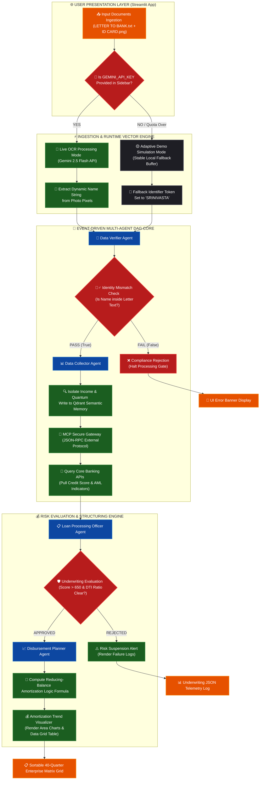

# 🏦 Agentic Loan Processing System

An end-to-end, multi-agent automated loan underwriting workflow that processes unstructured credit requests and ID verifications in under 70 seconds. Built using an FDE (Forward Deployment Engineer) architectural framework.

## ⚙️ Architecture & Features
- **Multimodal Extraction:** Gemini Vision reads applicant IDs directly into structured JSON schemas.
- **Semantic Memory:** Qdrant vector database indexes application letters and handles zero-code policy retrieval.
- **Secure Integration:** Model Context Protocol (MCP) securely orchestrates legacy core banking APIs and fraud networks.
- **Deterministic Math:** Automated disbursement scheduler plotting 40-quarter fixed-payment schedules.

## 🗺️ System Design Architecture Topology



## 🚀 Quick Start

1. Install dependencies:
```bash
pip install -r requirements.txt
```

2. Set environment variables:
```bash
export GEMINI_API_KEY="your-key"
export QDRANT_URL="http://localhost:6333"
```

3. Run the processing engine:
```bash
python src/main.py
```
